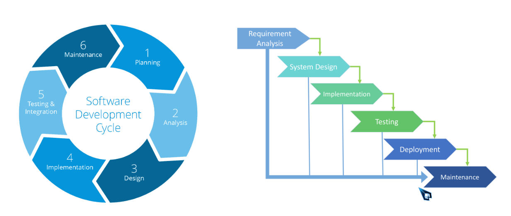
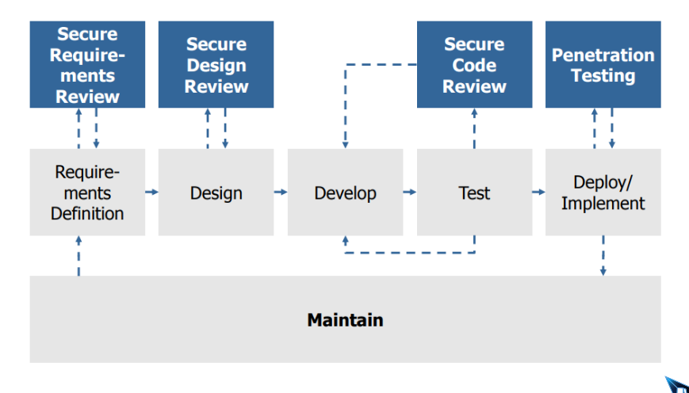
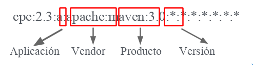
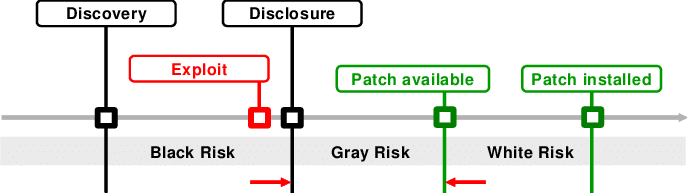

# 🏆 learning Desarrollo Seguro de Apps

## Conceptos

_"reducir los riesgos a un nivel que resulte aceptable"_

🦜 **Ciclo de vida software**



🦜 **Ciclo de vida de desarrollo seguro (SDLC Secure Software DEvelopment Life Cycle)**

- Si se detecta una vulnerabilidad durante los inicios del desarrollo es menos costoso.



🦜 **CPE**

Método estándar para describir e identificar software y hardware

```
cpe:2.3:a:apache:maven:3.0:*:*:*:*:*:*:*
```



## 🦜 **[Vulnerabilidad](https://github.com/jhonPariona/_learn-pentesting/blob/master/scanning.md#-vulnerabilidades)**

[Vulnerabilidades](https://github.com/jhonPariona/_learn-pentesting/blob/master/scanning.md#-vulnerabilidades)

Debilidad que puede ser explotada por una o más amenazas.

## 🏆 Gestión de dependencias y vulnerabilidades

Actualemnete pasan un aproximado de 3 dias hasta que un atacante aproveche una vulnerabilidad
publicada. Las empresas y desarrolladores deben reducir el tiempo de actualizaciones.



🦜 Se infectan dependencias(es más habitual atacar una subdependencia pequeña
para atacar a la dependecia principal) e ides de desarrollo por ello se debe
de tener cuidado de donde se descarga

🐧 **Prevenciones**

- 🦜 Eliminar dependencias no usadas
- 🦜 Monitorizar las versiones y vulnerabilidades usadas

🐧 **Listar dependencias que tenemos**

- npm ls
- mvn
- pip freeze

## **Soluciones busqueda vulnerabilidades en dependencias**

Buscan vulnerabilidades en el gráfico de dependencias

- Github en la pestaña de insigthsalerts es de pago
- [Snyk](https://snyk.io/plans/)
  - Gratuito ilimitado para repos privados
  - limitado 200 test repos privados al mes
  - [cheat sheat](https://res.cloudinary.com/snyk/image/upload/v1551195097/Snyk_CLI_Cheat_Sheet.pdf)
- [Fossa](https://fossa.com/pricing/)
  - Podemos ver las licencias que usan nuestras dependencias
- [Dependency-Check](https://owasp.org/www-project-dependency-check/)
  - Podemos intergrarlo a maver o gradle para que se ejecute automáticamente
  - usar la CLI que descarga la base de datis NVD
  - solo soporta java y .net
- [Pyup](https://pyup.io/)
  - Gratis repos publicos de python
  - muestra tbn las licencias
  - abre una isuee para qeu actualices las dependencias
- [lgtm](https://lgtm.com/)
  - LGTM es completamente gratuito para proyectos de código abierto. Nos integramos con GitHub y Bitbucket, y podemos analizar proyectos escritos en Java, Python, JavaScript, TypeScript, C #, Go, C y C ++.

## **Análisis de código**

Buscan vulnerabilidades públicadas [lista de herramientas](https://owasp.org/www-community/Source_Code_Analysis_Tools) |
[lista de analisis de código estático](https://github.com/analysis-tools-dev/static-analysis)

- [LGTM](https://lgtm.com/)
  - Gratis para proyectos open source
  - integracion con github a pull requests
- Kiuwan
  - de pago
- Sonar Qube
  - gratis para open source

## Entorno de práctica [WebGoat](https://github.com/WebGoat/WebGoat)

🦜 Tener instalado docker y docker-compose

```bash
$ curl https://raw.githubusercontent.com/WebGoat/WebGoat/master/docker-compose.yml |
docker-compose -f - up
```

🦜 Ingresar url `http://localhost:8080/WebGoat/login`

🦜 crearse una cuenta e ingresar

### Burp Suite

🦜 Ya viene instaldo dentro de Kali

[Crea un proxi](https://docs.google.com/presentation/d/1EF2_YMJFK8c0dIIST0ovcp32x9YRdETE/edit#slide=id.p1) para ver las cabeceras que se están enviando o recibiendo y activar el proxi en el navegador.

- si queremos capturar el trafico de una app con https debemos instalar un certificado; para ello burp suite nos da un certificado para ello entrar a la dirección de nuestro proxi e instalar el certificado.

## OWASP TEN

### SQL INJECTION

- Validación es mejor en el backend en el frontend podria ser por usabilidad pero no es seguro ya que el user puede desactivarlas.
- Usar ORMS ya que ya contienen soluciones frente a estos problemas.
- Usar Querys parametrizadas, ..
- siempre usar inputs validation nunca confiar en lo que el usuario nos podria enviar

### Broken Authentication

- usar frameworks como spring security
- Forzar la autenticación para todas las urls
- No es recomendable las preguntas seguras
- No admitir jwt sin firmar
- El secreto compartido de jwt debe de ser muy seguro sino se puede romper con jhon the ripper

### Sensitive Data Exposure

- Se debe de usar https
- no es recomendado MD5, mejor es sha256
- pbkdf2 es mejor para guardar contraseñas

### XML External Entities

- Usar mejor JSON(No tiene Entity)
- Si usamos XML y no usamos Entity desactivarlos.

### CSRF Cross site request forgery

- caad vez que se haga una peticion usar un nuevo token
- no usar token statico
- usar frameworks que ya implementas estas soluciones

### Broken access control

- No devolver informacion que no se va a pintar en el front

### Enumeración de usuarios

- autenticar para poder enumerar usuarios(proteger quien puede enumerar usuarios o el tiempo en q se hace esaas peticiones)

### Modificar accesos

- quien tiene autorizacion de hacer aciones en nuestros enpoints

### Fuzzing

- programas para dar entradas aleatorias y buscar fllos en nuestras app
- Dejar solo lo neesario para la producción
- Controlar accesos, numero de logins que pueden hacer los usuarios

### A6-Security Misconfiguration

- Errores de configuraciones
- subir el codigo en modo debug

### A7:2017-Cross-Site Scripting (XSS)

- injectar html o js a la app
- robar sesiones
- robar cookies de sesion
- deface de webs

**xss reflejado** ves la inyección si entras desde el link que se hizo la inyeccion si entras de otra forma no vez la inyección.

```javascript
some.com/page.html?default=<script>alert(document.cookie)</scr
ipt>
```

**xss persistente (stored)** inyectamos en comentarios, ahi si entramos a la página veremos la inyección
`some.com/page.html`

✔ Limpiar los inputs correctamente (no admitir etiquetas script) limpiar los parámetros que se pasan en las url limpiarlas, output encoding("sistema de plantilla")

### A8:2017-Insecure Deserialization

traducir estructuras u objetos a un formato que
puede ser guardado

Actualmente no debe usarse
